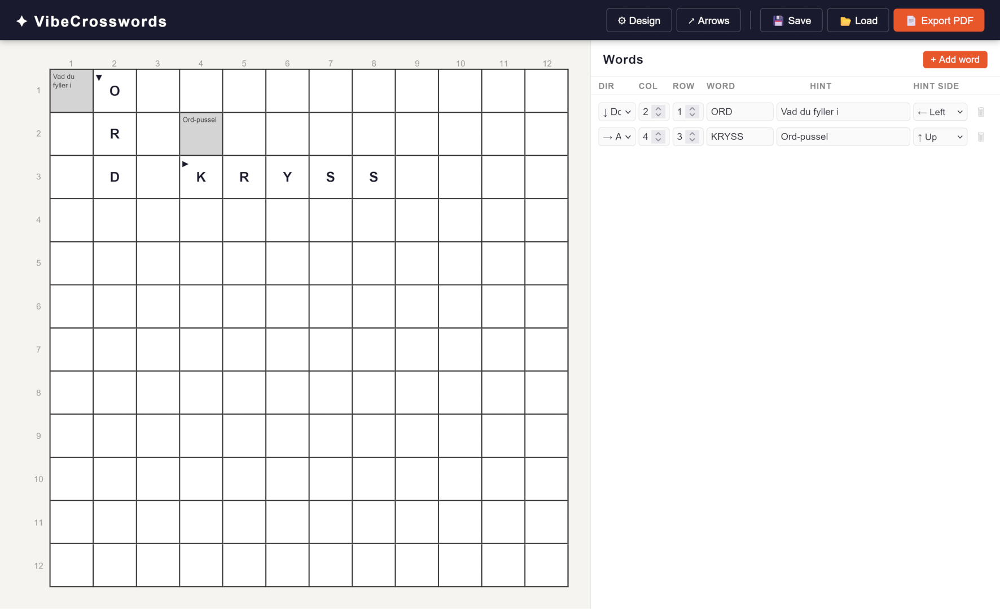

# VibeCrosswords



A web-based authoring tool for creating Scandinavian-style crosswords. In Scandinavian crosswords, clues are placed directly inside the grid ("hint cells") rather than in an external numbered list, creating a seamless and visually distinct puzzle experience.

## Features

* **Scandinavian-Style Grids:** Clues live directly inside the grid. No external numbering or clue lists are required or generated.
* **Dynamic Cell States:** Easily cycle through Empty, Blocked, and Hint states with a simple right-click. Letter cells are automatically managed based on word placement.
* **Real-Time Word Placement & Conflict Detection:** Type words into the panel and see them appear on the grid instantly. Overlapping words with mismatched letters are automatically highlighted in red.
* **Directional Arrows:** A robust arrow system allows for placement of 90° directional arrows at any corner of a cell (Top-Left, Top-Right, Bottom-Left, Bottom-Right) pointing in cardinal directions.
* **Customizable Design:** Adjust grid dimensions, typography (hint and letter font sizes), and colors (blocked cells, grid lines, hint backgrounds) via a live-updating settings panel.
* **Save/Load Functionality:** Serialize your work-in-progress to a local JSON file and load it back later.
* **Print-Ready PDF Export:** Export the finished puzzle directly to PDF using `jsPDF`. Includes an optional Answer Key page.

---

## Project Structure

The project uses a clean, modular Vanilla JavaScript architecture with no heavy framework dependencies. 

```text
crossword-builder/
├── index.html
├── css/
│   └── styles.css
├── js/
│   ├── main.js          # Bootstrap, event wiring
│   ├── grid.js          # Grid state, cell model, rendering
│   ├── words.js         # Word placement, conflict detection
│   ├── arrows.js        # Arrow overlay logic
│   ├── ui.js            # Toolbar, panels, settings sidebar
│   ├── serialiser.js    # JSON save / load
│   └── pdf.js           # PDF export via jsPDF
└── vendor/
    ├── jspdf.umd.min.js
    └── jspdf-autotable.min.js
```


## Usage Guide
### 1. Managing the Grid
The designer UI displays row and column numbers for easy reference, but these are stripped during PDF export.

- Right-Click any cell on the grid to cycle its state: Empty → Blocked (Grey) → Hint (Clue Container) → Empty.

### 2. Adding Words and Hints
Use the Word List Panel to construct the puzzle logic.

- Enter the Direction (Across/Down), Start Column, Start Row, the Word, and the Hint.

- The starting cell is automatically converted into a Hint cell and populated with your hint text.

- The remaining cells are populated with the letters.

### 3. Placing Arrows
Arrows guide the solver from the hint to the word.

- Toggle Arrow Mode from the top toolbar.

- Click any cell to open the inline popover.

- Select the anchor position (TL, TR, BL, BR) and the direction (▶, ▾, ◀, ▴).

### 4. Design Settings
Click ⚙ Design in the toolbar to adjust the aesthetics. Settings include:

- Grid: Width, Height, Cell Size.

- Typography: Hint font size, Letter font size, Font family.

- Colors: Blocked cell color, Hint cell background, Grid line color.

## Exporting & Saving
### JSON Save/Load
The entire state of the crossword is managed via a JSON data model. Clicking 💾 Save JSON exports a lightweight file containing the schema version, design settings, manual cell overrides, arrow placements, and the complete word list. Use 📂 Load JSON to resume work.

### PDF Export
Click 📄 Export PDF to generate a print-ready file using jsPDF.

- Page 1 (Puzzle): Renders the blank puzzle with clues, blocked cells, and arrows. Designer coordinates are removed.

- Page 2 (Answer Key): An optional toggle in the export dialog. Generates a replica of the grid with all letter cells filled in.